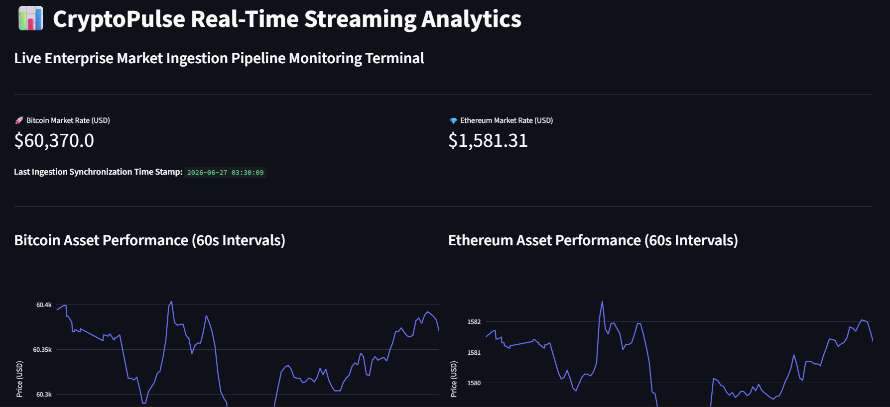

# CryptoPulse-Stream 🚀

An automated real-time data engineering pipeline and live analytics dashboard built with Python. The system polls high-frequency crypto market data, handles errors smoothly, and streams dynamic visualizations instantly.

---

## 📊 Live Dashboard Preview


---

## 💻 Tech Stack
* **Backend:** Python (Pandas, Requests, Schedule)
* **Frontend:** Streamlit & Plotly Express

---

## ⚡ Quick Start

### 1. Run Ingestion Pipeline
```bash
conda activate pytorch_online
python crypto_tracker.py
conda activate pytorch_online
streamlit run app.py